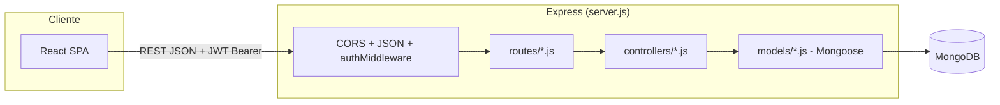

# 01 — Arquitectura Actual del Sistema de Estacionamiento

> Alcance: `Estacionamiento-AED2/` (backend + frontend). Fuente: código real, no documentación. Proyecto confirmado como trabajo académico (Instituto Superior Juan XXIII, Tecnicatura en Análisis de Sistemas, "Algoritmos y Estructuras de Datos 2", 2025 — ver [Informe_Tecnico_Limpio.md](../../Informe_Tecnico_Limpio.md)).

## 1. Stack tecnológico confirmado

| Capa | Tecnología | Evidencia |
|---|---|---|
| Backend | Node.js + Express | [server.js](../../backend/server.js) |
| Persistencia | MongoDB + Mongoose (ODM de documentos) | `mongoose.connect` en [server.js](../../backend/server.js) |
| Auth | JWT (firmado con `JWT_SECRET`), sin refresh tokens | [authController.js](../../backend/controllers/authController.js) |
| Frontend | React (Create React App, `config-overrides.js` con `react-app-rewired`) | [package.json](../../frontend/package.json) |
| Comunicación | REST/JSON vía `fetch`/axios en `frontend/src/services/*` | — |
| Infraestructura | Ninguna containerización/orquestación encontrada (sin `Dockerfile`, sin `docker-compose`, sin pipeline CI/CD) | `list_dir` de la raíz del proyecto |
| PDF | Generación local de tickets en `backend/facturas_pdf/` | [facturaController.js](../../backend/controllers/facturaController.js) |

**Diferencia fundamental con CGAS**: CGAS es una plataforma de microservicios .NET (Clean Architecture, EF Core, SQL Server, MediatR/CQRS, Dapr/RabbitMQ) con múltiples proyectos de base de datos (DBUp + SSDT). El Estacionamiento es un **monolito Node/Express + MongoDB** sin capas de aplicación (no hay Commands/Handlers/DTOs separados: los controladores acceden directo a los modelos Mongoose). Cualquier reutilización de CGAS debe ser **conceptual**, no de código ni de infraestructura.

## 2. Arquitectura de backend

- **No existe capa de "servicios de dominio"**: la lógica de negocio (cálculo de tarifa, validaciones de saldo, etc.) vive directamente dentro de los controladores (ver [estacionamientoController.js](../../backend/controllers/estacionamientoController.js)).
- **No existe capa de repositorios**: los controladores llaman a `Model.findOne/save` de Mongoose directamente.
- Middleware de autenticación: [authMiddleware.js](../../backend/middlewares/authMiddleware.js) (`verificarToken`) decodifica el JWT y revalida `activo` contra la base.
- Manejo de errores: [errorHandler.js](../../backend/middlewares/errorHandler.js) middleware genérico de Express al final de la cadena.
- 16 archivos de rutas montados bajo prefijos `/api/*` en [server.js](../../backend/server.js): `auth`, `usuarios`, `vehiculos`, `transacciones`, `comprobantes`, `estacionamiento`, `estacionamiento-estado`, `admin` (x2: admin + auditoría), `precios`, `facturas`, `configuracion-empresa`, `perfil`, `seo`, `analytics`.
- Existen **tres implementaciones paralelas y parcialmente inconsistentes** del mismo flujo de negocio (ingreso/egreso): `estacionamientoController`, `usuarioController.registrarIngreso/finalizarEstacionamiento`, y `transaccionController.crearTransaccionIngreso/registrarSalida`. Ver [02-FLUJO-ESTADIA-ACTUAL.md](02-FLUJO-ESTADIA-ACTUAL.md).

## 3. Arquitectura de frontend

`frontend/src/` (Create React App):
- `components/` — 26+ componentes, sin un framework de routing basado en roles consistente más allá de comprobar `rol` tras el login.
- `services/` — un archivo por dominio, llamadas REST al backend.
- `context/AuthContext.js` — guarda `token`/`usuario` en `localStorage` (ver riesgo de seguridad en la sección 6).
- `config/config.js` — autodetecta host de backend según `window.location.hostname`.

No hay gestor de estado global (Redux/Zustand); el estado se maneja con `useState`/Context.

## 4. Autenticación y autorización

- Login: [authController.js](../../backend/controllers/authController.js) función `login`, JWT con `{id, dni, rol, nombre, email}`, expiración 2h.
- Roles: solo `cliente` y `admin` (enum en [Usuario.js](../../backend/models/Usuario.js)). **No existe un rol "operador/cajero"** intermedio.
- El **primer usuario registrado se vuelve admin automáticamente** ([authController.js](../../backend/controllers/authController.js)).
- Autorización por rol **inconsistente entre rutas**: varias rutas administrativas críticas (`admin.js`, `usuarios.js` listar/editar, `facturas.js`) solo validan que exista un JWT válido (`verificarToken`), **sin comprobar `rol === 'admin'`** — ver hallazgos de seguridad detallados en [03-AUDITORIA-FACTURACION-ARCA.md](03-AUDITORIA-FACTURACION-ARCA.md) y en el plan de corrección (Etapa 0 de [08-PLAN-IMPLEMENTACION.md](08-PLAN-IMPLEMENTACION.md)).

## 5. Integraciones externas

| Integración | Estado |
|---|---|
| AFIP/ARCA (facturación electrónica) | **No existe.** Ningún llamado SOAP/HTTP a servicios de AFIP. Ver detalle en [03-AUDITORIA-FACTURACION-ARCA.md](03-AUDITORIA-FACTURACION-ARCA.md). |
| Email (SMTP) | Sí, para verificación de cuenta y recuperación de contraseña, credenciales **hardcodeadas en el código fuente** ([authController.js](../../backend/controllers/authController.js)) — riesgo de seguridad. |
| Pasarela de pago | No encontrada. Todo cobro es contra saldo prepago (`Usuario.montoDisponible`), no hay integración con Mercado Pago/tarjetas. |
| SEO/Analytics | `routes/seo.js`, `routes/analytics.js` — funcionalidad de marketing del sitio, no relacionada al dominio de negocio. |

## 6. Hallazgos de arquitectura relevantes para el plan

1. **Sin capas de aplicación**: cualquier funcionalidad nueva (turno/caja, cliente ocasional) deberá decidir si se mantiene el patrón actual (controlador con lógica embebida) o se introduce una capa de servicios de dominio reutilizable — se recomienda esto último dado que la Fase 6 del pedido exige compartir el "núcleo de negocio" entre canal App y canal Caja (ver [07-OPERACION-CAJA-SIN-USUARIO.md](07-OPERACION-CAJA-SIN-USUARIO.md)).
2. **Sin transacciones de base de datos**: ninguna operación usa `session.startTransaction()` de Mongoose pese a modificar múltiples colecciones por operación (`Usuario`, `Estacionamiento`, `Vehiculo`, `Transaccion`). Esto es una brecha de integridad crítica para diseñar caja/turno (que requiere atomicidad fuerte).
3. **Relaciones flojas**: `Estacionamiento` y `Transaccion` guardan `dni`/`dominio` como strings sueltos en vez de `ObjectId` con `ref`, lo que impide integridad referencial nativa de Mongo y obliga a resolución manual en cada controlador.
4. **Sin idempotencia ni locks**: no hay ningún mecanismo (`idempotency key`, `findOneAndUpdate` atómico, versión optimista) contra condiciones de carrera — crítico para diseñar caja (doble cobro) y turno (doble cierre).
5. **Credenciales y secretos débiles/expuestos**: `JWT_SECRET` trivial en `.env`, credenciales SMTP en código fuente, credenciales de usuarios de demo en Markdown en texto plano (`DATOS_PRODUCCION.md`). Deben resolverse antes de cualquier despliegue comercial (Etapa 0).
6. **Rutas de debug sin protección** montadas en el frontend de producción (`/debug-login`, `/debug-dashboard`, `/diagnostico`).

Estos puntos se retoman como "Etapa 0 — Correcciones estructurales" en [08-PLAN-IMPLEMENTACION.md](08-PLAN-IMPLEMENTACION.md), porque construir turno/caja y facturación real sobre una base sin transacciones ni permisos consistentes propagaría los mismos riesgos a las funcionalidades nuevas.
