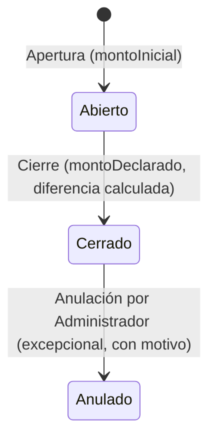

# 06 — Diseño: Cierre de Turno / Caja para Estacionamiento

> Basado en el análisis de `CierreDeTurnos` + `Tesoreria` de CGAS ([ver hallazgos crudos citados en 04 y 05](05-GAP-ANALYSIS-CGAS-ESTACIONAMIENTO.md)), adaptado conceptualmente al dominio de un estacionamiento (kiosco de 10 cocheras hasta playa grande). **No se copia el modelo de CGAS literalmente**: CGAS separa Turno/Caja/Tesorería en 3 microservicios acoplados por base de datos compartida (patrón identificado como frágil por el propio código de CGAS); el Estacionamiento es un monolito y puede resolver esto con una sola transacción local, lo cual es una ventaja a aprovechar.

## 1. Modelo funcional

### Conceptos y su equivalencia con CGAS

| Concepto Estacionamiento (propuesto) | Equivalente conceptual en CGAS | Adaptación |
|---|---|---|
| `Caja` | `Caja` (CierreDeTurnos/Tesoreria) | Recurso lógico/físico (ej. "Caja 1 - Playa Norte"), no requiere agrupación en `GrupoCajasTesoreria` (eso es específico de operaciones con múltiples cajas bancarias de CGAS) |
| `Turno` | `CierreTurno` | Sesión de trabajo de un operador sobre una `Caja`, con apertura y cierre explícitos (a diferencia de CGAS, donde la apertura es implícita) |
| `MovimientoCaja` | `MovimientoTesoreria` + `CierreDetalleOtroIngreso`/`CierreDetallePagoGasto` | Unificar en una sola entidad con `tipo: ingreso|egreso` y `origen: cobro_estadia|manual|ajuste` |
| `TurnoCobro` (resumen por medio de pago) | `CierreTurnoCobro` | Igual concepto, catálogo de medios de pago reducido |
| `TurnoDiferencia` | `CierreTurnoDiferencia` | Simplificado: solo diferencia monetaria (el estacionamiento no maneja stock de mercadería como CGAS/Gas) |

### Por qué NO copiar tal cual

- CGAS separa "Caja" de "Caja de Tesorería" (agrupador para depósitos bancarios/arqueos multi-caja) — **innecesario** para un estacionamiento chico/mediano; se puede fusionar en una sola entidad `Caja`.
- CGAS tiene un flujo "legado Estación" y un flujo "Gas" con reglas distintas e inconsistentes entre sí (p. ej. la prevención de doble apertura solo existe en el flujo Gas) — se debe tomar como referencia **solo el flujo Gas** (más robusto), no el legado.
- CGAS no valida consistencia de totales de forma centralizada y no tiene reapertura de turno — son gaps del propio CGAS que el Estacionamiento **debe resolver mejor**, no heredar.

## 2. Modelo de datos (diseño, sin scripts todavía)

### Entidad `Caja`
| Campo | Tipo | Notas |
|---|---|---|
| `_id` | ObjectId | |
| `nombre` | String | Ej. "Caja Principal" |
| `sucursalId` | ObjectId (opcional) | Si se soporta multi-sucursal (ver gap "Multi-tenant" en 05) |
| `activa` | Boolean | |
| `proximoNumeroTurno` | Number | Correlativo por caja |

### Entidad `Turno`
| Campo | Tipo | Notas |
|---|---|---|
| `_id` | ObjectId | |
| `cajaId` | ObjectId (ref `Caja`) | |
| `numero` | Number | Correlativo de `Caja.proximoNumeroTurno` |
| `operadorId` | ObjectId (ref `Usuario`, rol operador/admin) | Quién abrió |
| `fechaApertura` | Date | |
| `montoInicial` | Decimal128 | Efectivo declarado al abrir (fondo de caja) |
| `fechaCierre` | Date (nullable) | |
| `montoDeclaradoCierre` | Decimal128 (nullable) | Efectivo contado por el cajero al cerrar |
| `montoEsperadoCierre` | Decimal128 (nullable) | Calculado por el sistema |
| `diferencia` | Decimal128 (nullable) | `montoDeclaradoCierre - montoEsperadoCierre` |
| `estado` | Enum: `abierto`, `cerrado`, `anulado` | Sin "reapertura" automática — ver sección 5 |
| `observacionCierre` | String (opcional) | |
| `cerradoPor` | ObjectId (ref `Usuario`) | Puede diferir del que abrió (cambio de cajero) |

**Nota de diseño**: se prefiere un **estado explícito** (`abierto`/`cerrado`/`anulado`) en vez de inferirlo de flags booleanas como hace CGAS (`FaltaEmitirPlanilla`) — es más simple de auditar y de validar transiciones.

### Entidad `MovimientoCaja`
| Campo | Tipo | Notas |
|---|---|---|
| `_id` | ObjectId | |
| `turnoId` | ObjectId (ref `Turno`) | |
| `tipo` | Enum: `ingreso`, `egreso` | |
| `origen` | Enum: `cobro_estadia`, `manual`, `ajuste`, `devolucion` | Trazabilidad del origen (ver Fase 6 / doc 07) |
| `medioPago` | Enum: `efectivo`, `tarjeta`, `qr_transferencia`, `saldo_prepago` | Catálogo reducido respecto a CGAS |
| `monto` | Decimal128 | |
| `motivo` | String (obligatorio si `origen != cobro_estadia`) | |
| `estadiaId` | ObjectId (ref `Estacionamiento`, opcional) | Solo si `origen === cobro_estadia` |
| `comprobanteId` | ObjectId (opcional) | Referencia al comprobante fiscal emitido, si corresponde |
| `usuarioId` | ObjectId (ref `Usuario`) | Quién registró el movimiento |
| `fecha` | Date | |
| `anulado` | Boolean | Soft-state, no borrado físico |
| `anuladoPor` / `motivoAnulacion` / `fechaAnulacion` | — | Auditoría de anulación |

### Índices/constraints sugeridos
- Único: no permitir dos `Turno` con `estado: 'abierto'` para la misma `cajaId` (regla aplicativa + índice parcial único de Mongo: `{cajaId:1, estado:1}` con `partialFilterExpression: {estado:'abierto'}`).
- Índice `{turnoId:1, tipo:1}` para agregaciones rápidas del cierre.

## 3. Flujo

### Apertura
1. Operador/cajero selecciona `Caja` (o se le asigna una por defecto).
2. Sistema valida que no exista otro `Turno` abierto para esa caja (409 si existe).
3. Registra `montoInicial` declarado.
4. Crea `Turno` en estado `abierto`, `numero = Caja.proximoNumeroTurno`, incrementa el contador.

### Durante el turno
- Cada egreso de vehículo cobrado genera un `MovimientoCaja` con `origen: cobro_estadia`, vinculado al `turnoId` **activo de la caja que opera** (no al turno del ingreso, ver casos borde sección 5).
- Ingresos/egresos manuales de caja (ej. cambio, gastos menores) generan `MovimientoCaja` con `origen: manual`, motivo obligatorio.
- Descuentos/cortesías se registran como `MovimientoCaja` con monto reducido y `motivo` (no como movimiento negativo separado, para mantener trazabilidad 1:1 con la estadía).

### Cierre
1. Sistema calcula:
   - `totalPorMedioPago` = agregación de `MovimientoCaja` del turno agrupado por `medioPago`.
   - `efectivoEsperado` = suma de movimientos `medioPago: efectivo` (ingresos - egresos) + `montoInicial`.
2. Cajero cuenta el efectivo físico → ingresa `montoDeclaradoCierre`.
3. Sistema calcula `diferencia = montoDeclaradoCierre - efectivoEsperado`.
4. Cajero puede ingresar `observacionCierre` (obligatoria si `diferencia != 0`).
5. Se persiste todo en una única transacción atómica (`session.withTransaction`), cambiando `estado: 'cerrado'`.
6. El cierre **no bloquea** por vehículos que sigan estacionados (ver sección 5) ni por comprobantes ARCA pendientes — se marca un flag informativo, análogo a `DiferenciasPendientes`/`AvisoFacturacionAutomatica` de CGAS, pero sin impedir el cierre (igual criterio que CGAS: "la carga de valores cierra el turno igual, sin condicionar a que no hubiera diferencias").

### Campos del cierre — cuáles son necesarios y cuáles no

| Campo propuesto por el usuario | Necesario | Justificación |
|---|---|---|
| Total de estadías | Sí | Cálculo agregado simple |
| Total facturado | Sí | Suma de comprobantes emitidos en el turno |
| Total cobrado | Sí | Suma de `MovimientoCaja` |
| Desglose por medio de pago | Sí | Core del cierre |
| Efectivo esperado/declarado/diferencia | Sí | Core del cierre |
| Ingresos/egresos manuales | Sí | Ya modelados en `MovimientoCaja` |
| Comprobantes emitidos/anulados | Sí, como conteo | Para el resumen, no requiere modelo nuevo (se agrega por `turnoId` en el comprobante) |
| Vehículos que ingresaron/egresaron/permanecen | Sí, como **query de reporte**, no como campo persistido | Se calcula on-demand contra `Estacionamiento` filtrando por fecha del turno — persistirlo sería redundante y se desactualizaría |
| Fecha/hora y usuario responsable | Sí | Ya en el modelo `Turno` |

## 4. Estados y transiciones

No existe transición `Cerrado → Abierto` (reapertura) automática — ver sección 5, caso "error de cajero".

## 5. Casos importantes del cierre (respuesta punto por punto, según lo pedido)

| Caso | Propuesta |
|---|---|
| Vehículo entra en un turno y sale en otro | El `MovimientoCaja` (cobro) se asocia al turno **vigente al momento del egreso/cobro**, no al del ingreso. La estadía en sí no pertenece a un turno; solo el movimiento de caja lo hace. |
| Estadía iniciada antes del turno actual | Sin problema: el ingreso no depende de que haya un turno abierto (el ingreso puede registrarse incluso sin caja abierta si el modelo de negocio lo permite: ver nota abajo). El cobro sí requiere turno abierto en esa caja. |
| Estadía que permanece abierta al cerrar turno | No bloquea el cierre. Se reporta como "vehículos que permanecen dentro" (query, no campo persistido). Su cobro futuro se asignará al turno que esté abierto en ese momento. |
| Pago realizado por otro operador | Válido: el `MovimientoCaja.usuarioId` registra quién cobró; el `turnoId` es el de la caja operativa en ese instante, sin importar quién abrió el turno. |
| Cambio de cajero (mismo turno) | El turno permanece abierto; se puede registrar `operadorActual` como campo mutable separado de `operadorId` (quien abrió), o simplemente auditar cada `MovimientoCaja.usuarioId` individualmente — **se recomienda esto último**, no forzar cierre por cambio de persona. |
| Caja compartida / varias cajas | Cada `Caja` tiene sus turnos independientes; un operador puede tener acceso a varias cajas pero solo un turno abierto por caja. |
| Varias sucursales | Requiere `sucursalId` en `Caja` (ver gap "Multi-tenant" — diferible según alcance comercial). |
| Pago parcial | **PENDIENTE DE DEFINICIÓN**: hoy el sistema no soporta pagos parciales (todo o nada). Si se requiere, `MovimientoCaja` debería permitir múltiples registros contra una misma `estadiaId` hasta cubrir el total — evaluar en fase de implementación, no es parte del alcance mínimo. |
| Anulación posterior al cierre | Se permite anular un `MovimientoCaja` de un turno ya cerrado (soft-state `anulado`), pero **no se reabre el turno ni se recalculan sus totales retroactivamente** — el ajuste de diferencia se refleja en el turno **actual** (vigente), con referencia cruzada al turno original afectado, análogo a cómo CGAS resuelve diferencias de un cierre ya confirmado sin reabrirlo. |
| Reembolso | Se modela como `MovimientoCaja` con `tipo: egreso`, `origen: devolucion`, referenciando el `comprobanteId`/`estadiaId` original. |
| Diferencia de caja | Ver sección 3 — se calcula y persiste, sin bloquear el cierre (igual criterio que CGAS). |
| Cierre con vehículos todavía estacionados | Permitido, ver arriba. |
| Comprobante ARCA pendiente al momento del cierre | No bloquea el cierre; se marca un flag informativo `comprobantesPendientesARCA` en el resumen del turno (análogo a `AvisoFacturacionAutomatica` de CGAS), resuelto por un job de reconciliación (ver doc 04, sección "Reconciliación"). |
| Error de ARCA | El cobro de la estadía **no debe depender** de que ARCA responda — se cobra igual y el comprobante fiscal queda en estado `pendiente_cae`/`error_arca` para reintento asíncrono (ver 08, Etapa 2). |
| Cobro realizado pero factura pendiente | Mismo caso anterior: el `MovimientoCaja` se registra igual; el comprobante fiscal es un proceso desacoplado que puede completarse después. |
| Cierre de turno sin movimientos | Válido: `efectivoEsperado = montoInicial`, `diferencia = montoDeclaradoCierre - montoInicial`. No requiere tratamiento especial. |

## 6. Endpoints potenciales (diseño, no implementación)

| Endpoint | Método | Rol |
|---|---|---|
| `/api/turnos/abrir` | POST | operador, admin |
| `/api/turnos/actual` | GET | operador, admin |
| `/api/turnos/:id/movimientos` | POST | operador, admin |
| `/api/turnos/:id/resumen-cierre` | GET | operador, admin (previsualización antes de cerrar) |
| `/api/turnos/:id/cerrar` | POST | operador, admin |
| `/api/turnos/:id/anular` | POST | **solo admin** |
| `/api/turnos` | GET (histórico, filtros) | admin |
| `/api/cajas` | CRUD | admin |

## 7. Pantallas (ver detalle de UX en 08)

- Turno actual (estado, monto inicial, movimientos en vivo).
- Abrir turno (selección de caja + monto inicial).
- Cerrar turno (resumen + conteo de efectivo + confirmar).
- Movimientos de caja (listado + alta manual ingreso/egreso).
- Histórico de cierres + diferencias de caja.
