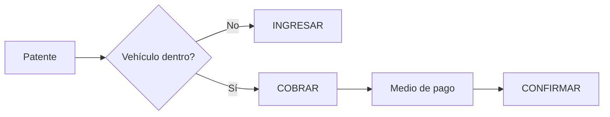

# 07 — Diseño: Operación de Caja sin Cuenta del Cliente (Cliente Ocasional)

## 1. Diagnóstico del problema actual

Confirmado en código (ver [01](01-ARQUITECTURA-ACTUAL.md)/[02](02-FLUJO-ESTADIA-ACTUAL.md)): **hoy es imposible operar sin una cuenta `Usuario`**.
- `Vehiculo.usuario` es `required: true` ([Vehiculo.js](../../backend/models/Vehiculo.js)).
- Todo ingreso hace `Usuario.findOne({dni, activo:true})` y responde 404 si no existe.
- El registro exige verificación de email antes de poder loguearse — no hay "alta rápida".
- Todo cobro es débito de saldo prepago (`Usuario.montoDisponible`), no hay cobro en efectivo en el momento del egreso.

Esto bloquea el caso de uso central pedido: kiosco/comercio/playa tradicional donde el conductor nunca usa la app.

## 2. Arquitectura recomendada para "cliente sin cuenta"

Evaluando las alternativas planteadas por el usuario:

| Alternativa | Evaluación |
|---|---|
| Crear un `Usuario` "falso" por cada visitante | **Descartado**: contamina la base de usuarios, complica reportes, y el propio pedido lo prohíbe explícitamente |
| Estadía sin `UsuarioId` (nulo) | **Parcialmente correcto**, pero deja huérfana la trazabilidad de a quién pertenece el vehículo/estadía |
| Vehículo independiente del usuario | **Correcto y necesario**: desacoplar `Vehiculo.usuario` para que sea **opcional** |
| Entidad específica "Cliente Ocasional" | **Recomendado como complemento**, no como reemplazo de lo anterior |
| Ticket anónimo | Es una consecuencia natural de lo anterior, no una entidad nueva separada |

### Diseño recomendado (combinación B + entidad ligera de datos ocasionales)

1. **`Vehiculo.usuario` pasa a ser opcional** (`required: false`). Un vehículo puede existir sin dueño registrado.
2. Se agrega a `Estacionamiento` (la estadía) un sub-documento **`clienteOcasional`** (no una colección separada con su propio ciclo de vida, para no crear una "cuenta light" disfrazada):
   ```
   clienteOcasional: {
     nombre: String (opcional),
     telefono: String (opcional),
     documento: String (opcional)
   }
   ```
   Ninguno de estos campos es obligatorio, salvo que una necesidad fiscal real lo exija (ver punto 6).
3. Se agrega a `Estacionamiento`/`Transaccion` un campo **`origen`**: `app | caja | manual | api` (ver sección 5) y **`operadorId`** (quién de caja lo registró, si aplica).
4. La patente (`dominio`) sigue siendo la clave operativa central: `PATENTE → INGRESAR`, sin requerir que el vehículo tenga un `Usuario` asociado.

**Por qué no una entidad "Visitante" con su propia colección**: agregaría una tabla más para sincronizar, sin necesidad real — el sub-documento embebido en la estadía es suficiente porque el dato del cliente ocasional solo tiene sentido en el contexto de esa estadía puntual (no se reutiliza entre visitas, a diferencia de un `Usuario`).

## 3. Nuevo flujo — Ingreso manual (desde caja)

**Endpoint propuesto**: `POST /api/estadias/ingreso-manual` (rol `operador`/`admin`).

Datos mínimos: `dominio` (patente), `tipoVehiculo`, `cajaId`/`turnoId` implícito. Opcionales: `observaciones`, `clienteOcasional.{nombre,telefono,documento}`.

Reglas:
1. Si el vehículo (`dominio`) ya existe en el catálogo (sea de un `Usuario` registrado o de una visita anterior), se reutiliza; si no existe, se crea un `Vehiculo` sin `usuario`.
2. Se valida que no tenga una estadía `activa` (mismo control anti-doble-ingreso que hoy).
3. Se crea la estadía con `origen: 'caja'`, `operadorId`, tarifa determinada por reglas generales (no por `Usuario.tarifaAsignada`, ya que no hay usuario).
4. **No requiere turno abierto para el ingreso** (el ingreso no mueve dinero); si se exige que toda operación quede vinculada a una caja abierta, es una decisión de producto a validar — por defecto se recomienda permitir el ingreso siempre, y solo exigir turno abierto en el momento del **cobro** (egreso).

## 4. Nuevo flujo — Egreso manual / cobro

**Endpoint propuesto**: `POST /api/estadias/:id/egreso-manual` (rol `operador`/`admin`, requiere turno abierto en la caja del operador).

1. Cajero busca por patente / listado de vehículos dentro (`GET /api/estadias/activas`).
2. Sistema calcula tiempo, tarifa, importe (reutilizando el **mismo servicio de cálculo** que usa el flujo de cliente registrado — ver sección 6).
3. Cajero selecciona medio de pago (efectivo, tarjeta, QR).
4. Sistema:
   - Registra `MovimientoCaja` (ver doc 06) en el turno vigente.
   - Genera el comprobante correspondiente (ticket no fiscal o factura, según configuración) con los datos disponibles del `clienteOcasional` (o "Consumidor Final" genérico si no se ingresó nada).
   - Marca la estadía como `finalizada`, libera el vehículo (`estActivo = false`).
5. Todo en una única transacción atómica.

## 5. Origen de la operación (canal)

Se recomienda un campo `origen` explícito en `Estacionamiento`/`Transaccion`/`MovimientoCaja`:

| Valor | Significado |
|---|---|
| `app` | Iniciado por el cliente registrado desde la app |
| `caja` | Iniciado por un operador desde el panel de caja, con o sin cliente ocasional |
| `manual` | Ajustes/movimientos de dinero sin relación a una estadía (ver doc 06) |
| `api` | Integraciones externas futuras (ej. totem de autoservicio, barrera automática) |

Junto con `origen`, registrar siempre `operadorId` (si `origen !== 'app'`) para saber qué administrador/cajero realizó la operación manual — requisito explícito de auditoría del pedido.

## 6. Reutilización del núcleo de negocio (cliente registrado vs. ocasional)

Diagnóstico: hoy el cálculo de tarifa vive **duplicado** en 3 controladores (ver doc 02). Antes de agregar un cuarto canal (caja/manual), se debe **unificar** en un servicio de dominio único, por ejemplo un módulo `services/estadiaService.js` con funciones puras:

```
calcularTarifa(usuarioOEstadia)      // ya existe como obtenerTarifa(), se debe extraer y unificar
calcularImporte(estadia, horaFin)
iniciarEstadia({ dominio, usuario|null, clienteOcasional|null, origen, operadorId|null, cajaId|null })
finalizarEstadia({ estadiaId, medioPago, operadorId|null, turnoId|null })
```

Ambos canales (App → `iniciarEstadia({usuario})` y Caja → `iniciarEstadia({clienteOcasional})`) deben llamar a la **misma función**, cambiando solo los parámetros de origen/cliente. Esto es exactamente lo pedido en la Fase 6 del análisis: "no quiero dos implementaciones completamente independientes de estadías".

Lo que **cambia** entre canales:
| Aspecto | Cliente registrado (App) | Cliente ocasional (Caja) |
|---|---|---|
| Identificación | `Usuario.dni` | Patente + datos opcionales |
| Medio de cobro | Débito de saldo prepago | Efectivo/tarjeta/QR en el momento |
| Quién dispara el egreso | El propio cliente desde la app | El cajero |
| Tarifa | Puede tener `tarifaAsignada` personalizada | Tarifa general por tipo de vehículo |

Lo que **no cambia** (se reutiliza 100%): cálculo de tiempo/importe, validaciones de estado (`estActivo`), generación de comprobante, lógica de facturación, registro de auditoría.

## 7. Permisos propuestos (a validar/ajustar, no definitivo)

| Acción | Cajero/Operador | Administrador |
|---|---|---|
| Ingresar vehículo (app o manual) | Sí | Sí |
| Egresar/cobrar | Sí | Sí |
| Consultar estadías propias del turno | Sí | Sí (todas) |
| Emitir comprobante | Sí | Sí |
| Movimiento manual de caja (ingreso/egreso) | Sí, con motivo obligatorio | Sí |
| Abrir/cerrar turno propio | Sí | Sí |
| Modificar tarifas | No | Sí |
| Anular operación/comprobante | No | Sí |
| Ajustes de diferencia de caja | No | Sí |
| Reabrir turno | No | Sí |
| Gestionar cajas/usuarios | No | Sí |
| Ver auditoría global | No | Sí |

Este modelo requiere agregar el rol `operador` al enum actual `['cliente','admin']` de `Usuario.rol` (hoy solo hay 2 roles, ver doc 01).

## 8. Experiencia de usuario objetivo


Sin pasos administrativos intermedios salvo que la operación sea sensible (anulación, ajuste), reservados a rol admin.

## 9. Auditoría específica de este flujo (requisitos del pedido)

Cada uno de estos eventos debe auditarse (reutilizando el patrón `Log*` generalizado, ver doc 05): ingreso manual, modificación de ingreso, egreso, modificación de tarifa, descuento, cortesía, anulación, devolución, ingreso/egreso de caja, apertura/cierre de turno. Campos mínimos: quién, cuándo, sobre qué vehículo/estadía, importe, medio de pago, comprobante, caja, turno — todos ya cubiertos por el diseño de `MovimientoCaja` + `Turno` (doc 06) + un `AuditLog` genérico (doc 08).

## 10. Puntos marcados como PENDIENTE DE DEFINICIÓN

- Si se requiere DNI/documento del cliente ocasional por alguna obligación fiscal específica (ej. para emitir Factura B a un monto determinado) — **REQUIERE VALIDACIÓN FUNCIONAL/FISCAL**, no se debe asumir un umbral sin confirmarlo.
- Si se permite pago parcial en el egreso manual — no está resuelto ni en CGAS ni en el Estacionamiento actual.
