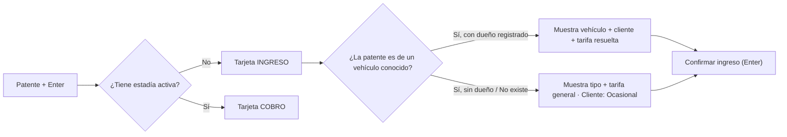

# Propuesta UX/UI — Panel de operación (administrador / cajero)

> Estado: **propuesta para validar**. No se tocó ningún componente todavía.
> Alcance: la experiencia del panel admin/cajero. No se rediseña la app del cliente conductor.
> Contexto de producto: [`PRODUCT.md`](../../PRODUCT.md). Plan funcional vigente: [`docs/analisis-gap-cgas/08-PLAN-IMPLEMENTACION.md`](../analisis-gap-cgas/08-PLAN-IMPLEMENTACION.md).

---

## 0. Hallazgos del código que condicionan el diseño

Estos son hechos verificados, no supuestos. Cada uno cambia lo que se puede dibujar.

| # | Hallazgo | Dónde | Consecuencia de diseño |
|---|---|---|---|
| 1 | **La terminal ya existe, pero está enterrada.** `CajaOperativa` y `TurnoPanel` son dos tabs dentro de `ListadosAdmin`, y `ListadosAdmin` es la cuarta opción del menú hamburguesa. | `ListadosAdmin.jsx:622-623` | Lo más importante del sistema está a 3 clics. El rediseño es sobre todo un problema de jerarquía, no de píxeles. |
| 2 | **No existe capacidad configurada en ninguna parte.** No hay `capacidad`, `sectores` ni `plazas` en `Sucursal`, `ConfiguracionEmpresa` ni ningún modelo. | `models/Sucursal.js`, `models/ConfiguracionEmpresa.js` | **"Ocupación 32/40" es hoy imposible.** Se puede mostrar "32 adentro"; el denominador requiere backend nuevo. No se inventa. |
| 3 | **No hay forma de ver el importe antes de cobrar.** `finalizarEstadia` calcula y cobra en el mismo request atómico. | `services/estadiaService.js:221-224` | El flujo pedido (ver importe → elegir medio → cobrar) necesita un endpoint de previsualización. Sin eso, el cajero cobra a ciegas. |
| 4 | **La tarifa no depende del tipo de vehículo.** `ConfiguracionPrecio` se resuelve por `tipoUsuario` (`asociado` / `no_asociado` / personalizada). Auto y moto pagan lo mismo. | `estadiaService.js:45-49` | Mostrar "Tipo: Auto · Tarifa: General" es correcto, pero hoy el tipo no cambia el precio. Es un gap de producto a decidir, no un bug de UI. |
| 5 | **El cobro por caja ya exige turno abierto** y devuelve 409 con mensaje en castellano. El ingreso no lo exige. | `estadiaService.js:251-261` | El estado del turno es información de primera línea en el header, y el bloqueo de cobro necesita un camino de salida inline ("Abrir turno"). |
| 6 | **La búsqueda por patente hoy trae todas las estadías activas y filtra en el cliente.** | `CajaOperativa.jsx:30-31` | Aceptable a escala de una playa (decenas), pero no sirve para buscar comprobantes, clientes ni historial. La búsqueda global necesita backend. |
| 7 | **El rol `operador` no existe.** El enum es `['cliente','admin']`; el rol operador es Etapa 1 del plan, pendiente. | plan Etapa 1.1 | El diseño se hace con la matriz de permisos del doc 07, pero hasta que exista el rol, todo el que entra al panel es admin. La navegación se filtra por rol desde el día uno igual. |
| 8 | **Redondeo:** `Math.ceil` de horas. Fracciones hacia arriba, sin fracción mínima ni tope diario. | `estadiaService.js:224` | La pantalla de cobro debe mostrar el redondeo explícito ("2h 12m → se cobran 3h"), o el cajero no puede defender el importe frente al cliente. |
| 9 | **No existe "patente no encontrada al salir"** como caso de negocio (ticket perdido), ni anulación de estadía, ni tarifa máxima. | — | Se diseña el estado de excepción, pero la acción requiere producto nuevo. |
| 10 | **El sistema visual actual es Material 2014 en claro.** `theme.css` define azul `#1a73e8`, radios de 8px, sin tema oscuro; los íconos son emojis en el markup. | `styles/theme.css:1-15`, `Navbar.jsx:81-155` | Es la anti-referencia. Se reemplaza el mundo visual, no se lo pule. |

---

## A. Arquitectura de navegación

### Criterio

1. **Máximo dos niveles.** Grupo → ítem. Nada más profundo.
2. **No se muestra lo que no existe.** Un ítem de menú que abre una pantalla vacía es peor que la ausencia del ítem. Abonos, convenios, descuentos, reglas de tarifa, sectores y métodos de pago configurables **no existen en el modelo de datos**: no entran al menú hasta que existan.
3. **El menú se filtra por rol.** El operador no ve Tarifas, Configuración ni Auditoría.
4. **Terminal no es un grupo.** Es el destino por defecto y vive solo, arriba de todo.

### Estructura propuesta

```
▸ TERMINAL                                    (sin submenú — home)

▸ PLAYA
    Vehículos dentro
    Historial de estadías

▸ CAJA
    Turno actual
    Movimientos
    Cierres                                    (histórico + diferencias)

▸ COMPROBANTES
    Comprobantes de estadía
    Recargas de saldo                          (las "pendientes de aprobación" de hoy)
    Facturas

▸ CLIENTES                                     [admin]
    Clientes
    Vehículos
    Saldos y transacciones

▸ TARIFAS                                      [admin]
    Tarifas
    Historial de cambios

▸ REPORTES                                     [admin]
    Recaudación
    Ocupación
    Cierres de caja

▸ CONFIGURACIÓN                                [admin]
    Empresa y facturación
    Sucursales
    Cajas
    Usuarios y roles

▸ AUDITORÍA                                    [admin]
    Actividad
```

### Diferencias con la estructura que propusiste, y por qué

| Tu propuesta | Propuesta acá | Razón |
|---|---|---|
| Operación / Caja / Clientes / Tarifas / Facturación / Reportes / Administración / Auditoría (8 grupos, ~35 ítems) | 9 grupos, 20 ítems, 4 de ellos solo admin | La mitad de tus ítems no tiene modelo detrás. Un menú que promete lo que el sistema no hace desgasta más rápido que un menú corto. |
| "Facturación → Estado ARCA / Pendientes-errores" | No entra todavía | Hoy **todo comprobante es ticket no fiscal sin CAE** (`comprobanteEstadiaService.js:4-7`). Una pantalla "Estado ARCA" sin ARCA es teatro. Entra completa en Etapa 6. |
| "Clientes → Abonos" | No entra todavía | No hay modelo de abono. Es la recomendación #1 de producto de la sección I, pero es funcionalidad nueva, no una pantalla que falta. |
| "Tarifas → Reglas / Descuentos / Convenios" | "Tarifas + Historial de cambios" | El historial ya existe (`LogPrecio`) y hoy está escondido dentro del tab de precios. Reglas y convenios son producto futuro. |
| "Administración → Sectores / Métodos de pago / Roles" | Sectores fuera; métodos de pago fuera | Los medios de pago son un enum fijo en código, no un catálogo administrable. Sectores no existen. Volverlos pantalla implica volverlos datos primero. |
| "Auditoría → Actividad / Operaciones sensibles" | "Auditoría → Actividad" con filtro por severidad | Son la misma tabla con un filtro. Dos ítems para un filtro es inflar el menú. |

### Sidebar

- Ancho expandido **240px**, colapsado **56px** (solo íconos + tooltip a la derecha).
- El colapso lo controla el botón hamburguesa del header y `[` como atajo. Se persiste en `localStorage`.
- La sidebar es un elemento del layout (`grid-template-columns`), **no** un overlay flotante: no se superpone al contenido en desktop y no hay saltos de alineación.
- Grupos colapsables con estado abierto persistido. El grupo que contiene la ruta activa se abre solo.
- Estado activo: barra de 2px a la izquierda + fondo sutil + peso tipográfico. Nunca solo color (falla en daltonismo y en oscuro).
- En colapsado, un grupo con ruta activa muestra un punto indicador sobre el ícono.
- En tablet/mobile la sidebar pasa a ser un `Sheet` sobre el contenido con backdrop.

---

## B. Pantalla principal: la Terminal

### Concepto

No es un dashboard. Es una **terminal de dos verbos**: `PATENTE → INGRESAR` y `PATENTE → COBRAR`. Todo lo demás está subordinado.

La idea estructural que sostiene todo el rediseño:

> **Un solo campo, dos verbos.** El operador no elige "voy a ingresar" o "voy a cobrar". Escribe la patente y el sistema resuelve en qué situación está ese vehículo. La tarjeta que aparece *es* la acción.

Esto no es una simplificación cosmética: elimina la decisión previa que hoy el operador tiene que tomar antes de tocar el teclado, y hace que el cliente registrado y el ocasional converjan en el mismo flujo sin que el cajero tenga que saber cuál es cuál.

### Layout desktop (≥1280px)

```
┌──────────────────────────────────────────────────────────────────────────────────────┐
│ ☰  Estacionamiento Centro · Caja 1 · ● Turno abierto 14:02      ◐  GC ▾              │ 48px
├────────────┬─────────────────────────────────────────────────────────────────────────┤
│            │  ⚠ 2 comprobantes pendientes de revisión                    Ver →       │ solo si hay
│  TERMINAL  ├──────────────────────────────┬──────────────────────────────────────────┤
│            │                              │  ADENTRO 32          Turno: 46 ↓ 39 ↑    │
│  PLAYA   ▸ │   PATENTE                    ├──────────────────────────────────────────┤
│  CAJA    ▸ │  ┌────────────────────────┐  │  Patente   Ingreso  Tiempo  Cliente      │
│  COMPROB ▸ │  │ AB123CD            [⏎] │  │ ─────────────────────────────────────────│
│  CLIENTES▸ │  └────────────────────────┘  │  AB123CD   14:32    2h 12m  J. Pérez  [$]│
│  TARIFAS ▸ │                              │  MNO456    15:10    1h 34m  Ocasional [$]│
│  REPORTES▸ │  ┌── resultado ───────────┐  │  AA111BB   15:44    1h 00m  Ocasional [$]│
│  CONFIG  ▸ │  │                        │  │  ...                                     │
│  AUDIT   ▸ │  │  (ingreso o cobro)     │  │                                          │
│            │  │                        │  │                                          │
│            │  └────────────────────────┘  │                                          │
│            │        420px                 │              resto del ancho             │
└────────────┴──────────────────────────────┴──────────────────────────────────────────┘
```

- **Columna izquierda (420px, fija):** el campo de patente y la tarjeta de resolución. Siempre en el mismo lugar, siempre con el foco al cargar la pantalla y después de cada operación. El operador aprende una sola posición en la pantalla.
- **Columna derecha (fluida):** la playa. Cabecera compacta con los contadores del turno y, debajo, la tabla de vehículos dentro, que ocupa el alto restante con scroll propio.
- **Banda de alertas:** aparece solo si hay algo accionable. Sin alertas no ocupa altura.

### Qué información va y qué no

| Dato | ¿Va? | Por qué |
|---|---|---|
| Vehículos dentro (número) | **Sí**, grande | Es el estado de la playa. Se calcula de `estado:'activo'`. |
| Ocupación X/Y y % | **Bloqueado** | No hay capacidad en el modelo (hallazgo #2). Se agrega cuando exista `Sucursal.capacidad`. |
| Ingresos / egresos del turno | **Sí**, chico | Ritmo del turno, contexto barato. |
| Recaudación del turno | **No** | **Decidido: caja ciega.** El operador no ve plata acumulada mientras opera ni el esperado antes de contar. Ver sección F. |
| Alertas accionables | **Sí**, condicional | Comprobantes pendientes, turno sin abrir, playa llena. |
| Gráficos, KPIs históricos, "actividad reciente" | **No** | Es la pantalla del turno en curso, no un reporte. Los reportes tienen su sección. |

---

## C. Flujo de ingreso



### Tarjeta de ingreso — cliente registrado

```
┌─────────────────────────────────────────┐
│  INGRESO                                │
│                                         │
│  AB123CD                                │   ← 32px, mono, tabular
│  Volkswagen Golf · Auto                 │
│                                         │
│  Cliente     Juan Pérez  ◆ Registrado   │
│  Tarifa      $1.500/h · Asociado        │   ← origen de la tarifa, explícito
│  Portón      Norte            ▾         │   ← default = último usado
│                                         │
│  ┌───────────────────────────────────┐  │
│  │  Confirmar ingreso           ⏎    │  │
│  └───────────────────────────────────┘  │
│  Esc para cancelar                      │
└─────────────────────────────────────────┘
```

### Tarjeta de ingreso — cliente ocasional

Misma tarjeta, mismos lugares, mismo botón. Solo cambian tres valores:

```
│  AB123CD                                │
│  Vehículo nuevo                         │
│                                         │
│  Cliente     Ocasional                  │   ← chip neutro, no advertencia
│  Tarifa      $2.000/h · General         │
│  Tipo        ● Auto   ○ Moto            │   ← segmentado, teclas 1 / 2
│  Portón      Norte            ▾         │
│                                         │
│  + Datos del conductor                  │   ← disclosure, colapsado
```

- "Ocasional" no es un error ni una advertencia: es un tipo de cliente normal. Se muestra en gris neutro, nunca en ámbar.
- `+ Datos del conductor` despliega nombre, teléfono, documento y observaciones. Los cuatro opcionales. El backend ya los acepta (`clienteOcasional`).
- **El tipo de vehículo solo aparece cuando el vehículo es nuevo.** Si ya está en el catálogo, el tipo se conoce y preguntar es ruido.
- **Cero confirmaciones.** Ingresar un auto no mueve dinero: Enter y listo, con toast.

### Objetivo de velocidad cumplido

`AB123CD` → `Enter` (resuelve) → `Enter` (confirma). Dos pulsaciones más el tipeo. El portón y el tipo tienen default; el 90% de los ingresos no los toca.

---

## D. Flujo de egreso / cobro

### Tarjeta de cobro

```
┌─────────────────────────────────────────┐
│  COBRO                                  │
│                                         │
│  AB123CD                                │
│  Volkswagen Golf · Juan Pérez           │
│                                         │
│  Ingreso        14:32                   │
│  Ahora          16:44                   │
│  Tiempo         2h 12m                  │
│  Se cobran      3 h  (fracción hacia    │   ← el redondeo, explícito
│                 arriba)                 │
│  Tarifa         $1.500/h · Asociado     │
│  ─────────────────────────────────────  │
│  TOTAL                       $ 4.500    │   ← 40px, tabular, máxima jerarquía
│                                         │
│  Medio de pago                          │
│  ┌────────┬────────┬────────┬────────┐  │
│  │Efectivo│Tarjeta │QR/Tran.│ Saldo  │  │   ← teclas 1-4; Saldo deshabilitado
│  └────────┴────────┴────────┴────────┘  │      si no hay cuenta o no alcanza
│                                         │
│  ┌───────────────────────────────────┐  │
│  │  COBRAR $4.500               ⏎    │  │
│  └───────────────────────────────────┘  │
└─────────────────────────────────────────┘
```

- El importe se muestra **antes** de cobrar. Requiere el endpoint de previsualización (hallazgo #3); es la dependencia técnica más importante de esta propuesta.
- El redondeo se explicita. Es la línea que le permite al cajero responder "¿por qué 3 horas si estuve 2 y pico?" sin llamar al dueño.
- Saldo prepago se deshabilita con razón visible: `Saldo $1.200 — no alcanza`. Nunca un botón muerto sin explicación.
- La confirmación vive **dentro** del botón (el monto está en la etiqueta). No hay diálogo modal encima.
- Después del cobro: toast `AB123CD egresó · $4.500 · Comprobante 00001-00000123`, la tabla se actualiza, el foco vuelve al campo de patente. Sin pantalla de éxito que haya que cerrar.

### Entrega del comprobante — decidido: PDF / digital, sin hardware

No hay impresora en el mostrador y no se diseña para una. Piezas que ya existen: **PDFKit** genera PDFs de factura (`facturaController.js:6,215`), **Nodemailer** ya manda mail (verificación de cuenta), y `backend/facturas_pdf/` ya es el directorio de salida. Falta generar el PDF del **comprobante de estadía** — hoy PDFKit solo cubre la factura de recarga de saldo.

El paso posterior al cobro no puede interrumpir la cola. Por eso la entrega vive **en el toast**, no en una pantalla:

```
┌──────────────────────────────────────────────────┐
│ ✓  AB123CD egresó · $4.500 · Efectivo            │
│    Comprobante 00001-00000123                    │
│    [ Descargar ]  [ Enviar ]                     │
└──────────────────────────────────────────────────┘
```

- **El toast dura más cuando trae acciones** (8s en vez de 4s), y no roba el foco: el cajero puede seguir tipeando la patente siguiente mientras está en pantalla.
- `Descargar` abre el PDF en una pestaña nueva. `Enviar` abre un popover chico con el mail del cliente **precargado si es un cliente registrado**; para ocasional, campo vacío y opcional.
- El comprobante siempre queda accesible después: Comprobantes → buscar por patente, número o fecha, con `Descargar` y `Enviar` en cada fila. El cliente que vuelve a pedirlo mañana no depende de que el cajero haya hecho algo hoy.
- **Formato del PDF:** A4 vertical, una sola página, bloque fiscal arriba (razón social, CUIT, domicilio, punto de venta — todo ya está en `ConfiguracionEmpresa`), detalle de la estadía en el medio (patente, ingreso, egreso, horas cobradas y el redondeo explícito, tarifa aplicada, medio de pago) y numeración de talonario abajo. **Leyenda obligatoria mientras no exista ARCA:** `Documento no válido como factura`. Se saca en Etapa 6, no antes.
- Si en el futuro aparece una térmica, el mismo contenido se re-maqueta a 80mm sin cambiar el flujo: la entrega ya está resuelta y la impresión sería una vía más, no un rediseño.

### Cadena completa al confirmar

Registra pago → genera comprobante → registra `MovimientoCaja` en el turno → finaliza la estadía → libera el vehículo. Todo en una transacción (ya implementado). La UI muestra un único estado de carga sobre el botón; si falla, **la estadía queda abierta** y el botón vuelve a estar disponible: nunca se pierde el auto por un error de red.

---

## E. Vehículos dentro

```
ADENTRO 32                        Buscar ⌕ ______________     Ingreso ↓
┌──────────┬─────────┬─────────┬───────────────┬──────────┬────────┬──────────┐
│ Patente  │ Ingreso │ Tiempo  │ Cliente       │ Tarifa   │ Portón │          │
├──────────┼─────────┼─────────┼───────────────┼──────────┼────────┼──────────┤
│ AB123CD  │ 14:32   │ 2h 12m  │ Juan Pérez    │ Asociado │ Norte  │ [Cobrar] │
│ MNO456   │ 15:10   │ 1h 34m  │ Ocasional     │ General  │ Sur    │ [Cobrar] │
│ AA111BB  │ 15:44   │ 1h 00m  │ Ocasional     │ General  │ Norte  │ [Cobrar] │
└──────────┴─────────┴─────────┴───────────────┴──────────┴────────┴──────────┘
```

- **Densidad:** filas de 36px, tipografía 13px, números tabulares. Entran ~18 filas en 1080p sin scroll.
- **Tiempo en vivo:** se calcula en el cliente desde `horaInicio` y se refresca cada 30s. Cada segundo sería ruido visual sin valor operativo.
- **Búsqueda instantánea** sobre patente y cliente, sin botón.
- **Orden por defecto:** ingreso descendente (lo último que entró, arriba). Ordenable por tiempo para detectar estadías largas.
- **Sin filtros** en el MVP: con 30-60 filas y búsqueda instantánea, un panel de filtros es peso muerto. Se agrega cuando exista sector o tipo con significado tarifario.
- **`Cobrar` siempre visible** en cada fila; carga la tarjeta de cobro en la columna izquierda (no navega, no abre modal). Acciones secundarias (ver detalle, editar ingreso, anular) en `⋮`.
- **Estados:** cargando → 6 filas skeleton; vacío → "No hay vehículos en la playa" + sugerencia de ingresar el primero; error → mensaje + botón reintentar, sin perder la búsqueda escrita.

---

## F. Caja y turno

**Decidido: un operador por turno.** El turno pertenece a quien lo abrió. Si entra otro cajero, el anterior cierra y el nuevo abre el suyo. La diferencia de caja siempre tiene dueño.

Esto **coincide exactamente con el modelo ya implementado**, así que no requiere backend nuevo: `Turno.operadorId` es obligatorio, hay índice parcial único que impide dos turnos abiertos en la misma caja, y `cerradoPor` es un campo separado —o sea que un admin puede cerrar el turno de otro sin que se pierda quién lo abrió— (`models/Turno.js:10,19,25-28`).

Consecuencias de interfaz:

- El header muestra **`Caja 1 · Turno #47 · G. Castellino`** como un bloque fijo, sin selector. No hay que elegir caja en cada operación.
- Si el operador logueado no es el dueño del turno abierto, la Terminal no deja cobrar: muestra `El turno #47 de Caja 1 está abierto por Juan Pérez` con dos salidas — `[Cerrar ese turno]` (solo admin) y `[Abrir turno en otra caja]`.
- El relevo se diseña como un flujo con nombre propio, **Cambio de turno**: cierra el turno actual con su arqueo y abre el siguiente en la misma pantalla, sin pasar por el menú.
- Si hay una sola caja configurada, el selector desaparece de todas las pantallas y la caja se resuelve sola.

### Turno actual

```
Turno #47 · Caja 1 · abierto 14:02 por G. Castellino          [Movimiento manual] [Cerrar turno]
┌──────────────────┬──────────────────┬──────────────────┬──────────────────┐
│ Fondo inicial    │ Estadías cobradas│ Ingresos playa   │ Egresos playa    │
│ $ 20.000         │ 39               │ 46               │ 39               │
└──────────────────┴──────────────────┴──────────────────┴──────────────────┘

Movimientos del turno
┌────────┬────────────┬────────────┬──────────────────────────┬───────────┐
│ Hora   │ Tipo       │ Medio      │ Concepto                 │    Monto  │
├────────┼────────────┼────────────┼──────────────────────────┼───────────┤
│ 16:44  │ Cobro      │ Efectivo   │ Estadía AB123CD          │  $ 4.500  │
│ 15:20  │ Egreso     │ Efectivo   │ Cambio turno siguiente   │ -$ 5.000  │
└────────┴────────────┴────────────┴──────────────────────────┴───────────┘
```

### Cierre de turno

**Decidido: caja ciega.** El cierre es en dos pasos y el orden no es negociable:

1. **Declarar.** El operador cuenta el efectivo y lo escribe. En esta pantalla no hay ningún total esperado, ni por medio de pago, ni acumulado. Solo el monto declarado y la observación.
2. **Resultado.** Recién al continuar aparecen fondo inicial, cobrado por medio de pago, esperado, declarado y diferencia. La diferencia con color semántico (cero = neutro, nunca verde; ≠ cero = ámbar). Observación obligatoria si hay diferencia.

`AlertDialog` de confirmación: cerrar turno es irreversible.

Consecuencias en el resto del panel, para que la caja ciega no tenga agujeros:

- La Terminal no muestra recaudación acumulada. Muestra **conteo** de ingresos y egresos del turno, que es información operativa, no plata.
- La tabla de movimientos del turno muestra cada movimiento con su monto (el operador acaba de cobrarlos, ocultarlos sería teatro) pero **sin fila de total ni subtotales**.
- "Estadías cobradas" se muestra como cantidad, no como importe.
- El admin sí ve todo: totales, esperado y diferencia en cualquier momento, desde Caja → Cierres.
- **Hasta que exista el rol `operador`** (Etapa 1 del plan), todo el que entra al panel es admin y ve los totales. La regla se implementa desde ahora en el componente, condicionada al rol, para que el día que exista el rol funcione sin rediseñar nada.

### Movimiento manual

Diálogo chico: tipo (ingreso/egreso), medio, monto, motivo obligatorio. Ya funciona así en `TurnoPanel`; solo cambia el envase.

---

## G. Sistema visual

### Escena física antes que paleta

El operador está en una garita o mostrador, muchas horas, con luz variable —de sol directo a las 15 h a garita a oscuras a las 3 de la mañana—. Por eso el tema oscuro no es una preferencia estética: es la condición de trabajo de la mitad del día. Y por eso el tema claro no puede ser blanco puro a máximo brillo.

### Color

Estrategia **restringida**: neutros + un acento. El color no decora, informa.

| Rol | Uso | Regla |
|---|---|---|
| Acento | Acción primaria, foco, fila seleccionada, item activo | Uno solo. Nunca en texto corrido. |
| Éxito | Operación completada, diferencia cero | Solo en confirmaciones, nunca como "estado normal" |
| Advertencia | Requiere atención: comprobante pendiente, diferencia de caja | |
| Peligro | Error, anulación, acción destructiva | |
| Neutro | Todo lo demás: el 90% de la pantalla | |

"Ocasional" es **neutro**. No es una excepción ni un riesgo.

### Tema claro / oscuro / sistema

Arquitectura de tokens en dos capas:

```
Capa 1 — primitivas:   --neutral-50 … --neutral-950, --accent-*, --success-*, …
Capa 2 — semánticas:   --bg, --surface, --surface-raised, --border, --border-strong,
                       --text, --text-muted, --text-subtle, --accent, --accent-fg,
                       --success-bg/-fg/-border, --warning-*, --danger-*,
                       --row-hover, --row-selected, --disabled-bg/-fg, --skeleton
```

Los componentes **solo** usan la capa 2. El tema cambia la capa 2 completa, no invierte colores.

- Claro: fondo gris muy tenue, superficies blancas, bordes visibles pero no duros.
- Oscuro: **no negro puro.** Fondo carbón, superficies *más claras* que el fondo (elevación por luminancia, no por sombra: las sombras no existen en oscuro). Texto no blanco puro para evitar halo en pantallas de garita.
- `color-scheme: light|dark` declarado, para que scrollbars, inputs nativos y `<select>` acompañen.
- Persistencia en `localStorage`, con `system` como valor por defecto y escucha de `prefers-color-scheme`.
- Sin flash al cargar: script inline en `index.html` que fija el atributo antes del primer render.
- Auditoría obligatoria en ambos temas de: sidebar, header, tablas (incluyendo filas alternas, hover y seleccionada), inputs, estados deshabilitados, badges, diálogos, dropdowns, tooltips, skeletons y toasts.

### Tipografía

- **Texto de UI:** stack del sistema (`-apple-system`/`Segoe UI`/`Roboto`). Cero peso de red, renderizado nativo, sensación de software del sistema operativo y no de landing page. Es exactamente el registro que pediste.
- **Registro numérico:** una monoespaciada con figuras tabulares para **patentes, importes, tiempos y horas**. Las patentes alineadas en columna y los importes que no bailan al actualizarse valen más que cualquier fuente de marca.
- Si más adelante querés una voz tipográfica propia, va en la mono, no en el texto de UI.
- Escala compacta: 20 / 15 / 13 / 12 px. Un solo tamaño grande, reservado al **TOTAL** de cobro y a la patente en la tarjeta.

### Densidad

- Grilla base de 4px. Alturas: fila de tabla 36px, input 34px, botón 34px (primario de cobro 44px).
- Padding de tarjeta 16px, no 32px. Radios 6px, no 12px.
- Sin sombras decorativas: separación por borde de 1px. Sombra solo en elementos que realmente flotan (dropdown, dialog, toast).
- Sin gradientes. Sin ilustraciones. Sin emojis: `lucide-react` en 16px (20px en la sidebar), con `stroke-width` uniforme.

---

## H. Stack y componentes

### Punto de partida real

CRA 5 (`react-scripts`) + `react-app-rewired` (solo para inyectar Workbox), React 18, React Router 7, **CSS a mano en cuatro archivos**, sin librería de componentes, sin TypeScript, sin Tailwind, sin Radix, sin TanStack. `AdminDashboard.jsx` tiene 940 líneas con estilos inline y `console.log` de depuración en producción.

> Nota: el README dice React 19.1.0 y muestra badges de "A11y AAA" y "Performance A+". El `package.json` fija React 18 y no hay medición detrás de los badges. Trabajo sobre el código, no sobre el README.

### Decidido: **una sola estrategia visual, ecosistema único** — se migra a Vite

```
Vite  +  Tailwind v4  +  shadcn/ui (modo JSX)  +  Radix (via shadcn)
      +  TanStack Table  +  lucide-react  +  cmdk  +  sonner
```

Por qué este conjunto y no otro:

- **shadcn/ui no es una librería que se instala, es código que se copia al repo.** Eso resuelve tu requisito de consistencia sin meter un framework de componentes con opiniones propias: los componentes quedan en `src/components/ui/` y se editan como código propio.
- Cubre **todo** tu listado del punto 14: Dialog, Drawer, Sheet, DropdownMenu, Popover, Tooltip, Select, Command, Tabs, Table, Toast, Badge, Skeleton, Form, AlertDialog. Sin mezclar sistemas.
- Radix llega por debajo: foco atrapado, `Esc`, roles ARIA y navegación por teclado ya resueltos. En un panel que se va a operar con teclado, eso es la mitad del trabajo de accesibilidad.
- Tailwind v4 mapea directo a las variables CSS de la sección G: los tokens semánticos son la fuente y las clases los consumen. El tema oscuro es un atributo en `<html>`.
- TanStack Table es headless: da orden, filtro y virtualización sin imponer estética.
- Se mantiene **JavaScript**, no TypeScript: shadcn genera JSX si se lo configura así. Migrar a TS es una decisión separada que no debería mezclarse con este rediseño.

### El costo honesto: hay que migrar el build

Tailwind v4 y shadcn asumen Vite. Sobre CRA 5 funciona a fuerza de parches sobre `config-overrides.js` y queda frágil. **La migración CRA → Vite es prerequisito**, y no es gratis:

| Qué toca | Riesgo |
|---|---|
| `config-overrides.js` → `vite.config.js` con `vite-plugin-pwa` (reemplaza `InjectManifest`) | Medio — hay que revalidar el service worker y `sw.js` |
| Variables `REACT_APP_*` → `VITE_*` en `.env` y `config.js` | Bajo, mecánico |
| `index.html` sale de `public/` a la raíz | Bajo |
| Scripts de `lighthouse` / `analyze` / `test:seo` | Bajo — cambian de comando |
| Imports sin extensión, `process.env`, `require` sueltos | Bajo — el build los detecta |

Es entre medio día y un día de trabajo, aislado y verificable. **Decisión tomada: se migra.** Con 20 pantallas por delante, escribir a mano Dialog, Sheet, Select, Command, Table, Toast, Badge, Skeleton y AlertDialog se paga veinte veces; migrar el build se paga una.

Condiciones con las que se ejecuta la migración, para que sea reversible:

- Va **sola, en su propio commit**, sin ningún cambio visual mezclado. Si algo se rompe, se revierte sin arrastrar el rediseño.
- Criterio de aceptación antes de seguir: la app compila, arranca, loguea, y el **service worker de producción sigue registrándose y cacheando** (es el único riesgo real; `InjectManifest` pasa a `vite-plugin-pwa`).
- Las variables `REACT_APP_*` se renombran a `VITE_*` en `.env`, `.env.example` y `src/config/config.js` en el mismo commit.
- Los scripts de `lighthouse`, `analyze` y `test:seo` se reapuntan; si alguno no tiene equivalente directo, se documenta en vez de dejarlo roto en `package.json`.

### Tablas: estrategia

Un único componente `DataTable` sobre TanStack, con contrato fijo: columnas declarativas, orden, búsqueda, paginación (solo donde hay volumen: historial, comprobantes, auditoría — **no** en vehículos dentro), acción primaria visible en fila, secundarias en `⋮`, y los cuatro estados obligatorios (carga con skeleton de la forma real de la tabla, vacío con causa y salida, error con reintento, sin resultados distinto de vacío).

---

## I. Referencias externas y clasificación de funcionalidades

### Qué se estudió

Se revisaron sistemas de gestión de estacionamiento profesionales y su literatura operativa: **SKIDATA** (portal, reporting central, estaciones de pago), **TIBA SPARK** (gestión centralizada de abonados mensuales, validaciones tipo eCoupon/guest pass, reportes de ocupación y transacciones), **FlashParking** (LPR, credenciales móviles, auditoría de actividad, políticas dinámicas por zona), **ParkHub** (dispositivos de validación en mano, ajuste de tarifas por demanda, consolidación financiera multi-playa), **Parking BOXX / Cashier BOXX** (la estación atendida: escanear ticket → calcular tarifa → cobrar → liberar barrera, con validaciones aplicadas *sin salir de la pantalla de transacción* y registro de operador, timestamp y monto de descuento), y **E-PARKING** (Argentina: conexión directa con ARCA, tipos de comprobante A/B/C y notas de crédito, abonados con bloqueo automático por mora, **caja ciega**, auditoría de tickets anulados, reportes de diferencia por turno y empleado).

Tres observaciones que valen más que la lista de features:

1. **La pantalla del cajero atendido es siempre una sola pantalla.** Ninguno de estos sistemas hace navegar al operador para cobrar. La transacción entera —incluidas validaciones y descuentos— ocurre en el mismo lugar. Es exactamente el principio del punto 3 de tu pedido, y coincide con lo que propone la Terminal.
2. **La caja ciega es estándar del rubro, no una paranoia.** El operador declara el conteo *antes* de ver el esperado. Es control interno, y cambia qué se puede mostrar en la pantalla principal.
3. **El ticket perdido es un caso de negocio de primera clase**, no una excepción rara. Todos lo tienen resuelto con tarifa máxima/diaria y registro auditado. Nuestro sistema no lo tiene.

### Clasificación

#### IMPORTANTE AHORA (entra en este rediseño o lo bloquea)

| Funcionalidad | Estado hoy | Nota |
|---|---|---|
| Terminal patente-first con dos verbos | Existe enterrada | El corazón del rediseño |
| Vehículos dentro en vivo con acción de cobro en fila | Existe crudo | |
| Previsualización de importe antes de cobrar | **No existe** | Bloquea el flujo de cobro pedido |
| Medios de pago + arqueo por medio | Existe | |
| Cierre de turno con diferencia | Existe | Falta decidir caja ciega |
| Capacidad configurable (para ocupación real) | **No existe** | Bloquea el indicador X/Y |
| Ticket perdido / patente no encontrada al salir | **No existe** | Estándar del rubro |
| Anulación de estadía/comprobante con motivo y auditoría | **No existe** | Requisito de control interno |
| Reimpresión de comprobante | **No existe** | Pedido diario en mostrador |
| Tarifa por tipo de vehículo (auto ≠ moto) | **No existe** | Hoy auto y moto pagan igual |

#### INTERESANTE A CORTO PLAZO

- **Abonos / clientes mensuales** con vencimiento y bloqueo por mora (TIBA, E-PARKING). Es el ingreso recurrente de una playa; hoy no existe el concepto.
- **Tope diario y tarifa nocturna.** Con `Math.ceil` por hora y sin tope, una estadía de 3 días factura 72 horas.
- **Fracción mínima configurable** (15/30 min) en lugar de hora entera fija.
- **Cortesías y validaciones de comercio** con código, monto y registro de quién la aplicó (Cashier BOXX).
- **Sangría / retiro de efectivo** con motivo — ya se puede hacer con `MovimientoCaja` manual, falta el atajo dedicado.
- **Reportes:** recaudación por medio de pago, por operador y por día; historial de diferencias de caja.
- **Impresión térmica 58/80mm** del comprobante.

#### FUTURO

LPR/ANPR y barreras automáticas · sensores de plaza · tótem de autopago · ticket digital con QR · reservas · multi-sucursal con consolidado real · integración con Mercado Pago / QR interoperable · tarifas dinámicas por demanda · portal de autogestión para abonados.

#### NO APLICA

Enforcement y gestión de multas · recargos por evento (estadios) · sistemas de guía y señalización de plazas · credenciales RFID corporativas · integración con hoteles/hospitales para cargo a habitación · yield management.

---

## J. Wireframes

### Terminal — desktop, con resultado de cobro

```
┌───────────────────────────────────────────────────────────────────────────────────────────┐
│ ☰   Estacionamiento Centro · Caja 1 · ● Turno abierto 14:02        ◐ Tema    GC ▾         │
├──────────┬────────────────────────────────────────────────────────────────────────────────┤
│          │ ⚠  2 comprobantes de recarga pendientes de revisión                    Ver →   │
│ ▪ TERMIN │├──────────────────────────────┬─────────────────────────────────────────────── │
│          ││ PATENTE                      │ ADENTRO 32              46 ingresos · 39 salidas│
│ ▸ PLAYA  ││ ┌──────────────────────────┐ ├────────────────────────────────────────────────│
│ ▸ CAJA   ││ │ AB123CD              ⏎   │ │ ⌕ ________       Patente Ingreso Tiempo Cliente│
│ ▸ COMPRO ││ └──────────────────────────┘ │ ───────────────────────────────────────────────│
│ ▸ CLIENT ││                              │ AB123CD  14:32  2h 12m  J. Pérez     [Cobrar] ⋮│
│ ▸ TARIFA ││ ┌── COBRO ─────────────────┐ │ MNO456   15:10  1h 34m  Ocasional    [Cobrar] ⋮│
│ ▸ REPORT ││ │ AB123CD                  │ │ AA111BB  15:44  1h 00m  Ocasional    [Cobrar] ⋮│
│ ▸ CONFIG ││ │ VW Golf · Juan Pérez     │ │ XY789ZW  15:58  0h 46m  M. Gómez     [Cobrar] ⋮│
│ ▸ AUDITO ││ │                          │ │ ...                                            │
│          ││ │ Ingreso   14:32          │ │                                                │
│          ││ │ Tiempo    2h 12m         │ │                                                │
│          ││ │ Se cobran 3 h            │ │                                                │
│          ││ │ Tarifa    $1.500/h       │ │                                                │
│          ││ │ ──────────────────────── │ │                                                │
│          ││ │ TOTAL         $ 4.500    │ │                                                │
│          ││ │                          │ │                                                │
│          ││ │ [Efec][Tarj][QR ][Saldo] │ │                                                │
│          ││ │ ┌──────────────────────┐ │ │                                                │
│          ││ │ │  COBRAR $4.500    ⏎  │ │ │                                                │
│          ││ │ └──────────────────────┘ │ │                                                │
│          ││ └──────────────────────────┘ │                                                │
└──────────┴┴──────────────────────────────┴────────────────────────────────────────────────┘
```

### Sidebar colapsada

```
┌────┬─────────────────────────────
│ ☰  │  Estacionamiento Centro · …
├────┼─────────────────────────────
│ ▪  │   ← Terminal (activo)
│ ⊞  │   ← Playa      · tooltip al hover
│ ▤  │   ← Caja
│ ⎘  │   ← Comprobantes
│ ⚇  │   ← Clientes
│ $  │   ← Tarifas
│ ◱  │   ← Reportes
│ ⚙  │   ← Configuración
│ ⛨  │   ← Auditoría
└────┴─────────────────────────────
   56px
```

### Excepción: vehículo ya adentro (intento de doble ingreso)

```
┌─────────────────────────────────────────┐
│  ⚠  AB123CD ya se encuentra dentro      │
│                                         │
│  Ingreso    14:32                       │
│  Tiempo     2h 12m                      │
│                                         │
│  [ Cobrar y egresar ]  [ Ver detalle ]  │
│  Esc para volver                        │
└─────────────────────────────────────────┘
```

No es un error rojo de sistema: es una situación esperable con dos salidas útiles.

### Excepción: la patente no aparece al salir (ticket perdido)

**Decidido: tarifa fija de excepción.** El auto está en la barrera y no hay estadía activa —se tipeó mal al ingresar, entró sin registrar, o el sistema estuvo caído—. El cajero cobra un monto configurable, sin negociar, y el caso queda registrado como excepción.

La pantalla ofrece las salidas en orden de probabilidad, y la de excepción es la última, nunca la primera:

```
┌─────────────────────────────────────────────────────────┐
│  AB123CD no tiene estadía activa                        │
│                                                         │
│  ┌───────────────────────────────────────────────────┐  │
│  │  Ingresar AB123CD                            ⏎    │  │   ← lo más probable:
│  └───────────────────────────────────────────────────┘  │      recién llega
│                                                         │
│  ¿El vehículo ya estaba adentro?                        │
│  → Buscar en vehículos dentro                           │   ← patente mal tipeada
│  → Cobrar como estadía no registrada                    │   ← excepción
│                                                         │
└─────────────────────────────────────────────────────────┘
```

Al elegir "Cobrar como estadía no registrada":

```
┌─────────────────────────────────────────────────────────┐
│  ESTADÍA NO REGISTRADA                                  │
│                                                         │
│  AB123CD                                                │
│                                                         │
│  ⚠ No hay registro de ingreso para esta patente.        │
│    Se aplica la tarifa de excepción configurada.        │
│                                                         │
│  TOTAL                                    $ 12.000      │
│                                                         │
│  Motivo (obligatorio)                                   │
│  ┌───────────────────────────────────────────────────┐  │
│  │ Ticket perdido — cliente sin comprobante          │  │
│  └───────────────────────────────────────────────────┘  │
│                                                         │
│  [Efectivo][Tarjeta][QR/Transf.]                        │
│                                                         │
│  ┌───────────────────────────────────────────────────┐  │
│  │  COBRAR $12.000                                   │  │
│  └───────────────────────────────────────────────────┘  │
│  Queda registrado como excepción a nombre de G. Castellino│
└─────────────────────────────────────────────────────────┘
```

Reglas:

- **El monto no se edita.** Sale de configuración; si el cajero pudiera escribirlo, la excepción se vuelve un acuerdo de mostrador y el control interno desaparece.
- **Motivo obligatorio**, texto libre con sugerencias frecuentes.
- Genera comprobante y `MovimientoCaja` como cualquier cobro, marcado como excepción.
- Aparece destacada en el cierre de turno y en Auditoría: es de las operaciones que un dueño quiere revisar sin buscarlas.
- **La operación es de rol operador**, no requiere admin: si requiriera autorización, la barrera se traba con el cliente esperando. El control es posterior (auditoría), no previo.
- Si más adelante se quiere un tope o una segunda tarifa (moto), sale del mismo lugar de configuración.

### Cierre de turno (variante caja ciega)

```
┌──────────────────────────────────────────────────┐
│  CERRAR TURNO #47 · Caja 1                       │
│                                                  │
│  Paso 1 — Declará el conteo                      │
│                                                  │
│  Efectivo contado    $ [ 82.400        ]         │
│  Observación         [ ____________________ ]    │
│                                                  │
│  ┌────────────────────────────────────────────┐  │
│  │  Continuar                                 │  │
│  └────────────────────────────────────────────┘  │
│                                                  │
│  ── al continuar ──────────────────────────────  │
│                                                  │
│  Paso 2 — Resultado                              │
│  Fondo inicial              $ 20.000             │
│  Efectivo cobrado           $ 63.900             │
│  Movimientos manuales      -$  5.000             │
│  Efectivo esperado          $ 78.900             │
│  Declarado                  $ 82.400             │
│  ─────────────────────────────────────────────   │
│  DIFERENCIA                 $ +3.500  ⚠          │
│                                                  │
│  [ Confirmar cierre ]   [ Volver a contar ]      │
└──────────────────────────────────────────────────┘
```

### Tablet (1024px) y mobile

- **Tablet:** sidebar colapsada por defecto. Terminal en dos columnas con la de patente a 380px. La tabla pierde las columnas Portón y Tarifa.
- **Mobile:** la terminal es una sola columna: patente arriba, resultado abajo. La tabla de vehículos dentro se vuelve lista de tarjetas de dos líneas (`AB123CD · 2h 12m` / `Ocasional · $4.500 estimado` + botón Cobrar). La jerarquía operativa no se rompe: patente y cobro siguen siendo lo primero y lo más grande.

---

## K. Errores, feedback y confirmaciones

### Errores: cuatro familias, cuatro tratamientos

| Familia | Dónde aparece | Ejemplo |
|---|---|---|
| Validación | Inline, bajo el campo | `Patente inválida. Formato AB123CD o ABC123.` |
| Regla de negocio | En la tarjeta, con acciones | `AB123CD ya registra una estadía activa desde las 14:32.` |
| Conexión | Banda persistente en el header | `Sin conexión con el servidor. Reintentando…` + acción manual |
| Permisos | En el lugar de la acción | `Solo un administrador puede anular una estadía.` |
| Cobro / turno | En la tarjeta de cobro, con salida | `No hay turno abierto en Caja 1.` + `[Abrir turno]` |
| ARCA (Etapa 6) | Estado del comprobante, no error | `Pago registrado · Comprobante pendiente de autorización` + `Ver detalle` |

Nunca un código HTTP en pantalla. El 409 del backend ya trae un mensaje en castellano listo para mostrar (`estadiaService.js:261`); ese es el patrón a extender.

### Feedback

Toast abajo a la derecha, 4s, con el dato verificable dentro:
`AB123CD ingresó · 16:42` · `Pago registrado · $4.500 · Efectivo` · `Comprobante 00001-00000123`.
Sin modal de éxito. Sin animación de celebración.

### Confirmaciones

- **Sin confirmación:** ingresar vehículo, buscar, cambiar de tema, navegar.
- **Confirmación dentro del flujo:** cobrar (el monto está en el botón).
- **`AlertDialog`:** anular estadía o comprobante, modificar monto a mano, cerrar turno, reabrir turno, eliminar tarifa, cambiar datos fiscales de la empresa.

---

## L. Teclado y command palette

### Convención elegida: teclas de función, como un POS

Un panel que se opera ocho horas necesita atajos que no compitan con el navegador. `Ctrl+E` y `Ctrl+I` son frágiles; las teclas de función son la convención real del rubro y están libres:

| Tecla | Acción | Nota |
|---|---|---|
| `F2` | Foco al campo de patente (ingreso) | |
| `F4` | Cobrar la estadía resuelta | |
| `F8` | Movimiento manual de caja | |
| `F9` | Cerrar turno | con AlertDialog |
| `Enter` | Resolver / confirmar | según el estado de la tarjeta |
| `Esc` | Cancelar y volver al campo de patente | |
| `1`–`4` | Medio de pago, en la tarjeta de cobro | |
| `Ctrl/Cmd + K` | Command palette | |
| `[` | Colapsar/expandir sidebar | |

Se evitan `F1`, `F3`, `F5`, `F6`, `F7`, `F10`, `F11`, `F12` (reservadas por el navegador).

Un panel de ayuda con `?` lista los atajos. Autofocus permanente en patente; `Tab` recorre el orden visual sin trampas.

### Command palette: sí, pero no en el MVP

Veredicto honesto: para el cajero **no agrega nada** —el campo de patente ya tiene el foco y resuelve el 90% de su trabajo—. Donde sí paga es para el **administrador**, que navega entre 20 pantallas: `Ctrl+K` para saltar a una sección, buscar un comprobante por número o un cliente por DNI.

Recomendación: se implementa cuando exista búsqueda global en backend (hallazgo #6), no antes. Una paleta que solo navega el menú es un menú más lento.

---

## M. Responsive

Prioridad **desktop → tablet → mobile**, como pediste. La regla que gobierna: *el responsive puede reordenar, nunca degradar la jerarquía operativa*. En los tres tamaños, lo primero que ve el operador es el campo de patente, y la acción primaria es el elemento más grande de la pantalla.

---

## N. Lo que este diseño necesita del backend

Ordenado por bloqueo:

1. ✅ **`GET /api/estadias/resolver/:dominio`** — **implementado**. Resuelve en un request: ¿está adentro?, ¿el vehículo existe?, ¿tiene dueño registrado?, ¿qué tarifa corresponde y por qué?, ¿cuánto se cobra?, ¿hay turno abierto?, ¿qué medios de pago están disponibles y por qué no los otros. Los dos endpoints que estaban previstos por separado quedaron en uno: la previsualización del importe es parte de la resolución, no una segunda llamada.
   - `services/estadiaService.js` → `resolverPatente()`, `obtenerTarifaDetallada()`, `calcularCobro()`
   - `controllers/estadiaManualController.js` → `resolverPatente`
   - `routes/estadias.js` → `GET /resolver/:dominio` (rol `operador`/`admin`)
   - Verificación: `backend/scripts/verify-resolver.js` — 22 checks, incluida la garantía de que el importe previsualizado es idéntico al cobrado.
   - **Cambio de comportamiento asociado:** el guard de saldo del ingreso ahora solo aplica al canal `app`. Un cliente registrado con saldo 0 puede ingresar desde caja, porque paga al salir por otro medio; antes quedaba trabado en la puerta por una regla que no correspondía a cómo iba a pagar (`estadiaService.js`, `iniciarEstadia`).
2. ✅ **Lectura del turno sin romper la caja ciega** — **implementado** para la fase 2:
   - `GET /api/turnos/:id/movimientos` — las filas del turno, sin agregación de ningún tipo.
   - `GET /api/turnos/:id/contadores` — estadías cobradas, ingresos y egresos de la playa. **Cantidades, nunca importes**: es lo único que la Terminal y Turno actual pueden mostrar con el turno abierto.
   - `GET /api/turnos` acepta ahora varios estados (`?estado=cerrado,anulado`): un arqueo anulado es el que más se busca y filtrarlo lo hacía desaparecer de la única lista donde se lo encuentra.
   - `GET /api/turnos/actual` popula el operador: el turno tiene dueño y el header lo nombra.
   - Verificación: `backend/scripts/verify-etapa4.js` — 21 checks, verdes después del cambio.
3. ✅ **Capacidad por sucursal y API de configuración** — **implementado** en la fase 4. `Sucursal` tenía `capacidad` y `tarifaExcepcion` en el modelo desde la Etapa 2 y **ninguna ruta**: los dos valores solo se podían cambiar entrando a Mongo a mano, aunque uno decide si la playa puede marcarse completa y el otro si el cobro de ticket perdido existe. Ahora `GET/POST/PUT /api/sucursales`, con el cambio auditado con su antes y su después.
   - También nuevos en la fase 4: `GET /api/estadias/historial` (lo que ya pasó, con filtros y paginación — `/activas` solo responde por el presente) y `GET /api/reportes/recaudacion` · `/ocupacion`, las dos agregaciones resueltas en la base y **solo para admin**: es exactamente la plata que la caja ciega le oculta al operador mientras cuenta.
4. **Rol `operador`** (Etapa 1 del plan) para que el filtrado de navegación por rol sea seguridad y no decoración.
5. Búsqueda global (patente / cliente / comprobante) — habilita la command palette.
6. Tarifa diferenciada por tipo de vehículo, tope diario y fracción mínima.
7. **Estadía no registrada (ticket perdido)** — decidido, y es la funcionalidad nueva más concreta que sale de este rediseño:
   - `ConfiguracionPrecio` (o config de sucursal) con **tarifa de excepción** configurable.
   - `POST /api/estadias/egreso-excepcion` → cobra sin estadía previa, con `motivo` obligatorio, generando comprobante + `MovimientoCaja` marcados como excepción.
   - Marca en el resumen de cierre y en `AuditLog`.
8. Anulación de estadía y de comprobante, con motivo y auditoría.
9. ✅ **Comprobante de estadía: superficie de lectura, PDF y envío** — **implementado** en la fase 3. Hasta acá los comprobantes se emitían en cada egreso y **no había ninguna forma de encontrarlos**: existían en la base y ninguna pantalla ni endpoint los leía.
   - `GET /api/comprobantes-estadia` — listado con filtros de fecha, medio de pago y búsqueda por patente o número.
   - `GET /api/comprobantes-estadia/:id` · `GET /:id/pdf` · `POST /:id/enviar`.
   - `services/comprobanteEstadiaPdf.js` — una sola definición del documento, que se escribe sobre la respuesta HTTP para la descarga o sobre un buffer para adjuntarlo al mail. El PDF dice **no fiscal** en el encabezado y al pie, y nunca muestra un CAE.
   - `services/mailService.js` — el transporte SMTP dejó de estar escondido dentro de `authController` y ahora es uno solo para todo el sistema.

El punto 1 era el único que **bloqueaba** la implementación del rediseño, y ya está resuelto. El resto habilita funcionalidad; el panel se puede construir sin ellos, degradando esos elementos con honestidad (por ejemplo: "32 adentro" en lugar de "32/40").

---

## Ñ. Alcance y plan de entrega

**Decidido: panel completo, y después la app del conductor.** Las pantallas del administrador migran todas al sistema nuevo, y una vez que el panel está entero se migra también la app del cliente conductor (fase 5), que hasta entonces queda intacta. Al final del recorrido `admin.css`, `theme.css`, `animations.css` y `Home.css` dejan de existir: un solo sistema visual en todo el frontend.

Es la entrega más grande de las posibles, así que se ordena en fases que se pueden validar de a una. Cada fase deja el panel usable; ninguna deja pantallas rotas conviviendo con pantallas nuevas.

**Estado de ejecución:** fases 0 a 5 ✅. El rediseño está completo.

Ya no queda ninguna pantalla del sistema viviendo en el mundo anterior. `admin.css`, `theme.css`, `animations.css`, `Home.css` y `App.css` fueron eliminados; el bundle pasó de **607 KB / 84 KB** (JS/CSS, al empezar la fase 4) a **430 KB / 38 KB**.

Fases 1 a 4 pasaron la revisión visual en navegador contra la base real. La ronda sobre 3 y 4 encontró tres defectos, todos corregidos y confirmados: el receptor de un comprobante ocasional se escribía «Final, Juan» porque el modelo guarda `apellido: 'Final'` como relleno (también salía así en el PDF que se lleva el cliente); «promedio por cobro» dividía el **neto** —con los egresos de caja ya descontados— por la cantidad de cobros, y con un egreso grande daba negativo; y la columna «Quién» de Auditoría mostraba el DNI pelado, sin decir que era un DNI.

**El menú del panel está entero.** No queda ninguna ruta mostrando una pantalla anterior, y `SeccionPendiente` se eliminó junto con su CSS porque ya no tenía a quién servir. `Empresa y facturación` fue la última en migrar, y salió reescrita, no envuelta.

Fases 3 y 4 están verificadas contra la API real con datos de la base; les falta **una pasada visual en navegador**, que quedó pendiente porque la extensión de Chrome se desconectó a mitad del trabajo.

**El panel viejo ya no existe.** Las tres acciones que lo mantenían vivo —dar de baja un cliente, reactivarlo, y el alta/edición/baja de vehículos— se migraron a Clientes y a Vehículos, y con eso se pudieron borrar las cuatro rutas legacy y sus componentes:

| Eliminado | Peso |
|---|---|
| `AdminDashboard.jsx` · `AdminGestion.jsx` · `ControlTransacciones.jsx` · `ListadosAdmin.jsx` | las cuatro pantallas ruteadas |
| `AuditoriaLogs.jsx` · `GestionFacturas.jsx` · `ListadoComprobantes.jsx` · `TurnoPanel.jsx` | sus hijas, que quedaron sin padre |
| `CajaOperativa.jsx` · `ConfiguracionEmpresa.jsx` · `Verificacion.jsx` | huérfanas: sin ruta ni import que las alcanzara |
| `styles/admin.css` | 31 KB, y con él los diez `side-tab` que el detector marcaba |

Efecto medido en el bundle: **JS de 599 a 477 KB** (139 → 120 gzip) y **CSS de 84 a 62 KB** (15,6 → 12,0 gzip). `src/components/` quedó con once archivos, todos de la app del conductor — que es exactamente el alcance de la fase 5.

Lo construido hasta ahora vive en `frontend/src/panel/`:

| Archivo | Qué es |
|---|---|
| `styles/tokens.css` | El mundo Playa pintada en dos capas (primitivas → semánticas), claro y oscuro |
| `styles/componentes.css` | Las primitivas compartidas: controles, tablas, mensajes, diálogos. Ninguna pantalla depende de que otra haya sido importada |
| `TemaProvider.jsx` | Claro / oscuro / sistema, persistido, sin flash |
| `AppShell.jsx` | Header + sidebar colapsable como columna del grid |
| `PanelLayout.jsx` | Resuelve caja y turno una vez y los baja por `Outlet` a todas las pantallas |
| `navegacion.js` | Los 9 grupos, filtrados por rol |
| `formato.js` | El registro numérico del panel: pesos, horas, duraciones, etiquetas de dominio |
| `terminal/Terminal.jsx` | Un campo, dos verbos |
| `terminal/TarjetaIngreso.jsx` · `TarjetaCobro.jsx` | Las dos caras de la resolución |
| `terminal/VehiculosDentro.jsx` | La playa, con ocupación, ritmo del turno y cobro en fila |
| `caja/TurnoActual.jsx` | Abrir, operar y cerrar: contadores sin plata y movimientos sin totales |
| `caja/CierreTurno.jsx` | Caja ciega en dos pasos, con confirmación irreversible |
| `caja/DialogoMovimiento.jsx` | Movimiento manual en `<dialog>` nativo, motivo obligatorio |
| `caja/TablaMovimientos.jsx` · `Movimientos.jsx` · `Cierres.jsx` | Las filas del turno y el histórico de arqueos |
| `comprobantes/ComprobantesEstadia.jsx` | Los tickets emitidos, con descarga y envío. La primera pantalla que los hace existir |
| `comprobantes/DialogoEnviar.jsx` | Envío por mail, con la dirección del cliente ya puesta cuando la hay |
| `comprobantes/Recargas.jsx` · `Facturas.jsx` | El circuito viejo de saldo prepago, en modo cierre: consultar, resolver lo pendiente, anular |
| `tarifas/Tarifas.jsx` · `DialogoTarifa.jsx` | La cascada explicada en la pantalla, y el aviso de que una tarifa con nombre no se aplica sola |
| `tarifas/HistorialTarifas.jsx` | Cada cambio de precio con su antes, su después y su variación |
| `playa/Dentro.jsx` · `HistorialEstadias.jsx` | La playa a ancho completo y el historial de estadías cerradas |
| `clientes/Clientes.jsx` · `Vehiculos.jsx` · `Saldos.jsx` | Cuentas, padrón de vehículos y el rastro del saldo prepago |
| `reportes/Recaudacion.jsx` · `Ocupacion.jsx` | Neto por día por medio de pago, y movimiento de la playa |
| `configuracion/Sucursales.jsx` · `Cajas.jsx` · `Usuarios.jsx` | Capacidad y tarifa de excepción, puestos de cobro, roles y tarifa asignada |
| `auditoria/Auditoria.jsx` | El rastro completo, con el antes y el después de cada cambio |
| `configuracion/Empresa.jsx` | Datos del emisor, con el veredicto de "¿se puede facturar?" arriba de los campos y el estado real de ARCA dicho sin adornos |

Y la app del conductor, en `frontend/src/cliente/`:

| Archivo | Qué es |
|---|---|
| `styles/cliente.css` | La misma paleta con otra densidad: controles de 48px, texto de 15px, una columna. Un celular a plena luz no es una garita a las 3 de la mañana |
| `Acceso.jsx` | Login. El formulario **es** la página: antes sus dos campos vivían dentro de un modal, detrás de un botón y de una pared de ilustraciones |
| `Inicio.jsx` | La home pública, contando lo que el producto hace hoy |
| `ClienteLayout.jsx` | Header con tema y salida, y navegación inferior fija: en un celular el pulgar llega abajo |
| `Panel.jsx` | ¿Tengo un auto adentro? Esa pregunta arriba de todo, y después los vehículos y el saldo |
| `Historial.jsx` | Cada estadía como ficha, con su comprobante descargable |
| `Perfil.jsx` | Identidad de solo lectura, datos editables y contraseña, separados |
| `Marco.jsx` | El envase compartido de las pantallas de acceso |
| `Registro.jsx` · `OlvideContrasena.jsx` · `NuevaContrasena.jsx` | Alta de cuenta y las dos puntas del circuito de contraseña |

`NuevaContrasena` cubre los dos enlaces que salen por correo —verificar una cuenta nueva y recuperar una contraseña— con un `modo`: es el mismo trabajo (validar un token y elegir una clave) con distinto texto y distinto endpoint. Lo que no comparten es el mensaje: quien verifica su cuenta no "recupera" nada.

**Otro bug de producción:** las tres pantallas de contraseña tenían `http://localhost:3000` escrito a mano. El circuito completo de verificación de cuenta y de recuperación **no funcionaba fuera de la máquina del desarrollador**: el usuario recibía el mail, hacía clic, y la pantalla no podía validar el token. Ahora todo pasa por `accesoService` y `config.js`.

Con esas cuatro pantallas se retiraron `theme.css` y `animations.css`, y `src/components/` quedó con **un solo archivo**: `SEO.jsx`. El sistema tiene una sola identidad visual.

**El conductor no podía ver sus propios comprobantes.** La app se los prometía y el único endpoint que los listaba era de admin. Se agregaron dos accesos acotados por el DNI del token, nunca por un parámetro de URL: `GET /api/estadias/mias` (las estadías propias con su comprobante) y la descarga del PDF propio, que ahora verifica titularidad en el controlador — el mostrador baja cualquiera, un cliente solo el suyo. Verificado en los dos sentidos: 200 con el propio, **403 con uno ajeno**.

**Un bug de producción que apareció al migrar el dashboard:** `estacionamientoService` consultaba el estado de cada vehículo contra `GET /api/vehiculos/estado/:dominio`, que **devolvía 404**. `routes/vehiculoEstado.js` existía pero nunca se montó en `server.js`, y la ruta correcta es `/api/estacionamiento/estado/:dominio`. O sea: la app del conductor preguntaba en cada carga si el auto estaba adentro, recibía un 404, y **nunca podía mostrarlo**. Corregido en `conductorService`, y el archivo de rutas muerto eliminado.

La home anterior vendía tres cosas que la poda había dejado falsas —recarga de saldo por comprobante, ingreso "desde cualquier portón" y control de accesos por portón— más una que nunca fue una funcionalidad: "vigilancia 24/7 con seguridad garantizada". Encuadre decidido con el usuario: **playa comercial real**, sin el marco de proyecto académico universitario.
| `SeccionPendiente.jsx` | Lo que todavía no se migró, dicho con honestidad |

| Fase | Qué entra | Por qué en este orden |
|---|---|---|
| **0 · Cimiento** | Migración CRA → Vite (commit aparte), Tailwind v4 + shadcn/ui JSX, capa de tokens, tema claro/oscuro/sistema con persistencia, `AppShell` (header + sidebar colapsable), `DataTable`, primitivas de formulario, toasts, diálogos, íconos | Nada se puede migrar antes de que exista el sistema. Al final de esta fase el panel viejo ya vive dentro del shell nuevo. |
| **1 · Terminal** | Campo de patente, resolución, tarjeta de ingreso, tarjeta de cobro, vehículos dentro, excepciones, atajos de teclado | Es la razón del rediseño. Se valida con un cajero real antes de seguir. Depende de los dos endpoints bloqueantes de la sección N. |
| **2 · Caja** | Turno actual, movimientos, cierre en dos pasos (caja ciega), cambio de turno, histórico de cierres | Cierra el ciclo del día del operador. |
| **3 · Comprobantes y tarifas** | Comprobantes de estadía con descarga/envío, recargas de saldo, facturas, tarifas, historial de cambios | Lo que el admin toca todas las semanas. |
| **4 · Administración** | Clientes, vehículos, saldos y transacciones, historial de estadías, reportes, configuración de empresa, sucursales, cajas, usuarios, auditoría | El resto. Volumen alto, riesgo bajo: son tablas y formularios sobre componentes ya probados en las fases anteriores. |
| **5 · App del conductor** | Home pública, login y registro, dashboard del cliente, historial y perfil, sobre los tokens y las primitivas del panel. Se retiran `admin.css`, `theme.css`, `animations.css` y `Home.css` | Va última a propósito: es la superficie que menos plata mueve y la única que puede esperar. Pero entra sí o sí — mientras conviva con las hojas viejas, el sistema tiene dos identidades visuales y dos formas de escribir un botón. **Ojo:** el mundo del panel se diseñó para una garita a las 3 de la mañana; la app del conductor es un celular a plena luz. Los tokens se heredan, la densidad no: la app del cliente necesita blancos de toque más grandes y menos filas por pantalla. |

Limpieza que aprovecha la migración, para no arrastrar deuda al sistema nuevo:

- `DebugLogin.jsx`, `DashboardDebug.jsx`, `NetworkDiagnostic.jsx` y `Login_temp.jsx` están ruteados o presentes en producción. No se migran: se sacan.
- `ListladoComprobantes.jsx` (con la errata) es un duplicado de `ListadoComprobantes.jsx`. Se elimina.
- Los `console.log` de depuración de `AdminDashboard.jsx` (hay más de veinte, incluyendo el token) no viajan al código nuevo.
- La URL `http://localhost:3000` hardcodeada en `AdminDashboard.jsx:36,148,187` pasa a la config de entorno como el resto del proyecto.
- `AdminDashboard.jsx` (940 líneas, cuatro vistas y estilos inline) se disuelve en las pantallas que le corresponden según el menú de la sección A; deja de existir como componente.

**Lo que no cambia hasta la fase 5:** la app del cliente conductor (`Dashboard`, `Historial`, `Perfil`, `Home`, registro y recuperación de contraseña) queda intacta durante las fases 0 a 4. El panel es un producto separado dentro del mismo sistema, y se termina antes de tocar la app del conductor.

---

## O. Decisiones abiertas (ping-pong)

Se preguntan de a una, en este orden:

1. ~~**Caja ciega o caja transparente.**~~ → **RESUELTO: caja ciega.** El operador no ve recaudación acumulada ni el esperado antes de declarar el conteo. Aplicado en las secciones B y F.
2. ~~**Un operador por caja/turno.**~~ → **RESUELTO: un operador por turno.** Coincide con el modelo ya implementado; sin backend nuevo. Aplicado en la sección F.
3. ~~**Qué pasa cuando la patente no aparece al salir.**~~ → **RESUELTO: tarifa fija de excepción**, monto no editable, motivo obligatorio, control posterior por auditoría. Aplicado en la sección J y en el punto 7 de la sección N.
4. ~~**Impresión.**~~ → **RESUELTO: PDF y envío digital**, sin hardware. Entrega desde el toast (`Descargar` / `Enviar`) y desde Comprobantes. Aplicado en la sección D.
5. ~~**Alcance del rediseño.**~~ → **RESUELTO: panel completo**, en cinco fases validables. Aplicado en la sección Ñ.
6. ~~**Build.**~~ → **RESUELTO: migrar a Vite**, en commit aparte, con el service worker como criterio de aceptación. Después: Tailwind v4 + shadcn/ui (JSX) + TanStack Table + lucide + cmdk + sonner. Aplicado en la sección H.

---

**Las seis decisiones están cerradas.** Lo único que queda antes de escribir código es fijar el mundo visual concreto: paleta, materiales y carácter tipográfico del panel, dentro del registro ya acordado (serio, denso, POS/ERP, sin ornamento, claro y oscuro). Eso se decide con opciones a la vista, no por escrito.
